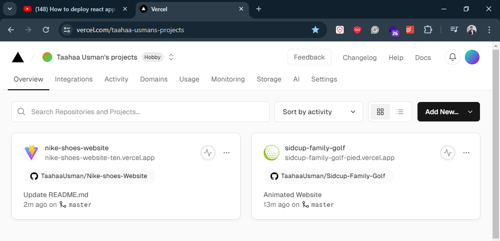

# How to get every Coursera course for free?

https://www.youtube.com/watch?v=tGolDIB0UZI

# React Learn what matters by sheriyan coding school

## What is React?

React ak front-end javascript libaray ha, jo ka single page application bana ka liya use hoti ha, isa banaya tha facebook ka engineer na jis ka name clake type kuch tha,

## Why to use React?

Is liya React ko banaya gaya tha ka facebook ak single page application ha os page par hi like aor bahut sari activities hoti hain, lakin like karna par bhi page refresh ho jata tha aor refresh ma zahir si bat ha aor bhi kafi cheezain refresh hoti thin to website kafi slow hoti thi, is liya React banaya gaya.

## How React works?

Javascript ka ander ak DOM hota ha, aor wo ak dosra sa connected hota ha, DOM ka ak part par action perform karna par sara document object model effect hota ha, par react ka ander asa nahi hota, React apna ander ak virtual DOM create kar lata ha, jis sa DOM ka kisi ak part par effect karna sa siraf wo hi part change hota ha baki page same rahta ha, aor website bahut fast chalti ha, basically hota asa ha ka jis part ka hama alag karna maksod ho on ka ham alag alag files bana lata hain, aor jab koi event ka mutabik change karna ho to simple wo part ki file change ho jati ha baki part same rahta ha, website smoth chalti rahti ha.

## when to use React?

Jab bhi hama zara bara level ma koi web app banani hoti ha to, aor asi app jis ma bahut sara components hain aor bahut sara reuseable structure ha, to ham react use kar sakta hain.

## How to make React app?

Pala to yar ak aor tarika sa banata tha, ab pata nahi ya vite wala masla ban gaya ha, barhal vite name ki website par jana ha aor oder sa start kar sakta hain.

wasa command nicha liki hoi ha simply isa bhi chala sakta hain

npm create vite@latest

## Folder structure of React

_Ya Allah ma bhik magnta hon muja yad rakna ki takat da_

## What are Node modules in React?

Node modules ka ander wo files hoti hain ka React app ko chlna ka liya chya hoti hain, is sa zayada jana ki zarorat nahi ha

## What is Public Folder in React?

Is folder ka ander ham apna static data rakin ga, jasa ka pictures , videos yan other files, is sa zayada kuch nahi

## What is SRC Folder in React?

src folder ka ander ak folder Assests ha, is ka ander bhi ham static data put kar sakta hain.
Ab baki 'src' ki files ka ander hama baki data put karna ha, components banana hain

## First program in React?

simple ak short hand ha 'rfce' type karna ha basic structure a jaya ga

## What is this jsx?

jsx => java script XML
<br>
jsx simple html ki tara hi liki jati ha, lakin is ka pass power hoti ha ka ya html ko ander {} laga kar java script liki ja sakti ha aor html ka ander ya nahi kiya ja sakta

## Setps to set up tailwind CSS

1. "https://tailwindcss.com/" par jayain
2. Get started par click karin
3. Gramework guide par jayain
4. Vite par click karin
5. Install Tailwind CSS -> ki dono lines ko terminal ma chlayain
6. Tailwind.config.js ka sara code paste karin
7. index.css ka ander wala code paste karin
8. npm run dev

## How to add css in components

simply app.jsx ka ander mana style add karna ki try ki to mana index.css ka ander style add kiya

## How to create components in React

1. Compnent banana ka liya hama scr folder ka ander ak jsx name ki file banani ha 'File ka first letter capital hona chya'
2. 'rfce' likna ha file ka ander
3. Needed changes kar ka , App.jsx ka ander link karna ha
4. jasa ka About ko kiya gaya ha, <About /> etc.

## Use of useState() function

useState ka matlab hota ha react ka ander variable banana, aor bass is sa zayada kuch nahi

```
var [a, b] = useState(value);
```

'a' ka ander variable ki value ha, aor 'b' ak function ha jis ka ander ham vaiable ki value update kar sakta hain, means ka javascript ka operations perform ka sakta hain

## What is onClick={} function in jsx?

java scirpt ki tara yahn bhi kisi jsx ki ak tag par onclick laga sakta hain aor os par {} laga kar value change yan koi bhi operation perform kar sakta hain.

## Creation of variable using useState()

```
  var [age, ageFunc] = useState(21);
```

## Using value of variable in jsx

```
      <h2 className='font-bold text-xl'>{age}</h2>
```

## Changing value using ageFunc named function also use of onClick

```
    <button className='mx-3 my-2 px-3 py-1 bg-green-500 rounded-md text-s text-white' onClick={()=> {ageFunc(age+1);}}>Click</button>
```

# From now to onword Start the serier of Chai and React.

_In this series we will learn all about React_

1. index.html

index.html just like (!) shortcut html ha jis ka ander ak div hota ha jis ki id root hoti ha aor os ka bad ak script linker hota ha jo ka javascript ko link karta ha aor baki total work os javascript ka link ki madat sa ider render hota ha

2. main.jsx

main.jsx ka ander bass simple code lika ha jis ka ander

- React
- Reactdom
- Other files components import howa howa hota hain.
  <br>
  We can use any file as main.jsx because in side the main.jsx there is only some imports are exist and a function which links the jsx's files to index.html

3. Other components

Other components of jsx are just function which perform specific task and display it to main.jsx and main.jsx use the function of other components and display using the need. This is all the concepts of react.

4. Extra things:

After the above three point there are few things are left like pulic folder assests folder these two folder are used to store the assets for the project. And, node_modules are folder which store the needed tools for building the project.

## Building custom React

Must of the stuff is on the practical basics.
**Steps:**

1. make an index.html file
2. make an script file and link the both files
3. using dom select the root id from index.html into the script file
4. make the object<html tag> which you want to insert into html file
5. make a function and convert the js object into html tag.
6. append all changes into root id
7. call the funtion and pass the arguments
   - For more detail kindly visit:
     <br>
     (C:\Users\Bismillah Computers\OneDrive\Documents\Learn React\React aor Chai\Building custom React)

## What did i learn from this lecture?

We build a custom react and see how the internal react works, now we know that what is react. React is basically javascript. And if react is javscript so we can write functions into any file and we call import that function from one file to another and we can call that function as we call in javascript <function_name ()>
In this lecture we seen that the folder structure in vite@react used jsx(html like structure) but that structure at the end converts into an object and that object creates an html tag and its attributes etc. and we append that object into index.html

`Because the components of react are function so we can write it as:`

```
function MyApp(){
    return(
        <>
            <h1>Hello how are you! What's about your love</h1>
            <a href="https://www.google.com">visit google</a>
        </>
    )
}

ReactDOM.createRoot(document.getElementById('root')).render(
    <MyApp />
)
```

_The above code will also give the output_

## We know that all tags of jsx are javascript objects but can we write the objects and render it?

No, we can'not render the javascript object. Because the function render is writen by the vite library or react, vite write the structure of render function that we don'not know the porperties of that objects. And these all things converting behind the seen. So, we can'not render our custom objects.

## how react convert the jsx tags into javscript object?

In real time the jsx tags convert into this kind of structure and below code will be execute.

```
let another_custom_element = React.createElement(
    'a',
    {href:'https://www.google.com/',target : '_blank'},
    'Click to visit google'
)

ReactDOM.createRoot(document.getElementById('root')).render(

    another_custom_element

)
```

## how variable of javascript shown in react element?

In react element the variable are shown as just like a storage device. It can'not perform any action or evaluate something.The variable wil be shown as evaluated expression.

```
let message = 'Welcome';
let another_custom_element = React.createElement(
  'a',
  {href:'https://www.google.com/',target : '_blank'},
  'Click to visit google ',
  message
)

ReactDOM.createRoot(document.getElementById('root')).render(

  another_custom_element

)
```

## Did we can add if/else into javascript expression?

No, we can'not add if/else, for like activities into jsx expression.

```
<h1>Hello {variable}</h1>
```

In this syntax, we can only add the evaluated expression.Because, this jsx tags are not javascript they are objects, and we can'not perform if/else activities into javascript objects.

## Lecture # 5

<h1 style='color: red; font-size: 40px; text-align: center;'>What are hooks in React</h1>

hooks are the functions in react. And every hook have a specific logic and use. for example, we have a hook 'useState' is used to update the variable value inside the React components.
<br>
If we update a variable without using useState it will not change the UI.
hooks are the methods in react.Every methods have his own responsibility.Basically these methods build by react for performing specific tasks.

```
function App() {
  let val = 1;

  function add_value(val){
    val = val + 1;
    console.log('Value is Updated !');
  }
  function reduce_value (val){
    val = val -1;
    console.log('Value is Reduced');
  }

  return (
    <>
      <h1>Welcome to Learn Hooks {val}</h1>
      <button onClick={add_value}>Add Value {val}</button>
      <button onClick={reduce_value}>Reduce Value {val}</button>
      <p>Some thing: {val}</p>


    </>
  )
}

export default App
```

_in the above code val number will not be updated in the UI_

## Lecture # 6

<h1 style='color: red; font-size: 40px; text-align: center;'>Virtual DOM, Fibre and Reconciliation</h1>

## Did React use Virtual DOM now a days?

This is a bit of heavy concept, but as such i fell make some sence with me is that, React is no longer use Virtual DOM. React use the concept of reconcilation.

## What is Reconcilation?

Reconcilation is the algorithm of React uses to diffirentiate two trees for determining which part need to be changed.

This is a thoufh concept. But we will dive into it Inshallah.
[Here is the link of detailed article](https://github.com/acdlite/react-fiber-architecture "Documentation of React")

## Lecture # 7

_In this lecture we setUp vite project and we setUp tailwind CSS and make a little stuff with it. Please check what we build in this lecuture i make a folder name Lecture # 7 please check and try to understand what i have done_

```
C:\Users\Bismillah Computers\OneDrive\Documents\Learn React\React aor Chai\Lecture7>
```

In this lecture we also discuss props. But we will start props from start in the morning. And remember when you start writing notes, Delete this line of notes, and start learning props from the video... Have a nice sleep, good night....

## what is prop?

Prop is react method. which is used to reuse the components of react, and also prop is used to pass the data from one component to another component or all other component.

## Revision points:

When i Revise the props i ask chatGpt for some simple tasks for practing props in React. ChatGPT give me tasks and also there are 8 posibilities about props.

- Simple data passing to component
- Passing functions to child component, also paramerized and unparametized
- Conditional rendering
- Arrays and objects (map function for arrays)
- Updating parent from child component
- Styling components from props
- Nested components
- Default props

**In this lecture i learn:**

1. how to add tailwind css
2. what are props, and why props used?
3. how to send data from one component to another component.
4. how to send all types of data from one component to other components
5. how to receive data from one component to other component, two ways
6. how to set default value if value is not given in props.
   <br>
   **we use the UI?**
   <br>
   [Link of UI Website](https://www.devui.io/ "Click to visit website")

**where the practical of all above concepts:**

```
C:\Users\Bismillah Computers\OneDrive\Documents\Learn React\React aor Chai\Lecture7>
```

## Lecture # 8

<h1 style='color: red; font-size: 40px; text-align: center;'>A react interview question on counter</h1>
This is an interview question there is not anything about notes. But i make this in my folder of Lecture8. Plz check that forlder for clarity.
```
C:\Users\Bismillah Computers\OneDrive\Documents\Learn React\React aor Chai\Lecture8>
```

## Lecture # 9

# Build a react project | bacground_Changer ?

_In this lecture, I build a small project which is backgound changer, This was a basic project but i learn some concept of js and also concept of Reacts_
**Learned concepts:**

1. We can write inline css using {{backgoundColor : 'red'}} kind of structure
2. When we use {{}} we do not need of another parenthesses for variable.
3. We can write call back function in the onClick method of jsx.just like:

```
<button className="rounded-full px-5 py-2 text-white mx-1 bg-red-500" onClick={()=>set_action('red')}>Red</button>
```

4. we can'not initialize direct function in the onClick method. Means:
   `      onClick={set_action('red')}
     `
   _we can'not write like this. Because onClick demand a function and this line will execute the function and it will return something but we did not need the returned value. So, the onClick method expect a function so we give call back function._

## Lecture # 10

<h1 style='color: red; font-size: 40px; text-align: center;'>useEffect, useRef and useCallback with project</h1>
_In this lecture we will learn about above hooks and also we build a random password generator which have the feather of_
1. Generator a random password
2. We can increase the lenght of password
3. We have a checkpoint for adding numbers in passoword
4. We have a checkpoint for special characters addition
5. We have a copy button
6. We have a scroll bar which can increase the lenght of password
7. And page will not reload for all above operations

## I got problem in generating random number. So, I will learn that later.

I learn a lot in this lecture many things are confusing, i can'not understand but it will take time for graping me about hooks concepts
<br>
**Key points:**

1. I learn how to generate random password in react and also i spend many time for building UI, on the conclusions i felt that. I am very weak in building UI also. So, i have to learn that also.
2. I learn how many things about input field:
   - How to add onChange in input field.
   - How to make checkpoints of input field
   - How to add label with input field
   - How can we set value of input using a variable in react
   - I learn readOnly method of input
   - I learn how to convert a input field into a range field, and also min, max and value fields in input
   - We learn how to pass reference of input and how to refere the referece to other tags
3. I learn basic use of useCallback hook, it is used to save the dependencies to chache mamory
4. I learn basics of useEffect hook, it is used to add effects in page, like we have dependencies and when we change these dependencies this will atomatically run. by using this hook we can atomate things
5. I learn the introduction of useRef and this is used to pass the reference from one element to other elements. Basically this hook perform the action of comunication between tags of jsx.

### when revise this lecture go to the project for better understanding what i done, because most of the things i done was copy and pasting.

Well... Good luck for morning. Here is the end of 3-Feb-2024.... Good night

## Lecture # 11

# Building custom hooks in react with currency changer project

_In this lecture we will build a custom react hook. A hook is basically a function that perform some task and give output. So, We will build a currency_converter function(hook) and we will use this in this project_
<br>
**Steps to achieve this project:**

1. Build a project of vite
2. Connect tailwind
3. Build a custom component of .js extension which will be work as our custom hook. And write a function. In this function call a useEffect hook for atomatically run the code based on dependencies.
4. Fetch the api and recieve the json data (currencies_rates). also convert that recieved string into json format. Plz view the code for functionalities.
5. Use a then function and pass the currency name into a variable which we want to check the rates.
6. Create a Inbox field for putting data.
7. This is a failed video, But But But, I know a word which is currency changer. And i will build it later. And i will made many currency changers.And grap all concepts which are related to currency changer app.

## How can we write a className in tailwind css style?

by using backticks ``, inside backtick we can write {brackets} and we can use variable.

## A better approach for import?

A better approach for import in big projects of react is.
<br>
import all componets into another file and then export the components from there.
<br>
Syntax:

```
import InputBox from './InputBox'
impoty App from './App'

export {InputBox, App};
```

## Lecture # 12

<h1 style='color: red; font-size: 40px; text-align: center;'>React Router crash course</h1>
In this lecuture we almost master the react router(means different data on different urls_) 
**We wil learn:**
1. We are making a beautifull single page application
2. How to handle github api
3. How to chache the data from url

## What i learn in this lecture after watching this lecture?

First of all, this was a successfull lecture, I learn many concepts.
<br>
**Steps:**

1. Build all your components in component folder and write there jsx in that folder
2. export all components into a index.jsx file inside components and when we need some import we simply import from this index.jsx file.
3. When we use React-router-dom we will not use App.jsx in the main.jsx file.
4. In the App.jsx we use a method or hook of react-router-dom which is [Outlet]. In App.jsx we will set components which are not changing like footer, header and some other components which will not change.
5. And where we use <Outlet />. This will allow to let components from outside.Now we will go to the main.jsx and create routers and set components to display. And we will set on which route which componet will be display.
6. in main.jsx we have a <RouterProvider> method which we use. And also this method by default takes a prop. In this lecture we call that prop 'router'.
7. Now we have a method 'createBrowserRouter' which will make the routes.

The syntax is given below:

```
const router = createBrowserRouter([
  {
    path: '/',
    element: <App />,
    children : [
      {
        path: '',
        element: <Home />
      },
      {
        path: 'about',
        element: <AboutUs />
      },
      {
        path: 'contact',
        element: <ContactUs />
      },
      {
        path: 'user/:userid',
        element: <User />
      },
      {
        loader: {githubInfo},
        path: 'github',
        element: <Github />
      }
    ]
  }
])
```

8. After this we seen a new feather of react-router-dom the 'loader'. By default react load the component when the component will be called. But this method can load component before the component call.
9. In making route we can nesting any route useing the children propertie.
10. In this lecture I learned how to take dynamic value from the url.

```
      {
        path: 'user/:userid',
        element: <User />
      }
      import { useParams } from 'react-router-dom'
      const {userid} = useParams();
```

## Can we use anchor tag in react?

No, we did not use anchor tag because anchor tag refresh the whole page. So, we use Link tag. We call 'href' of anchor tag as 'to' in Link tag.

## What is NavLink?

React router-dom provides this method. In this method we can give a callback function at the place of className. and we have some default variable for this method. Like `isActive` & `isPending`.

## How to take dynamic data? In the url?

## Revision New Topics:

- When I revising i get a new concept of `useNavigate` which is also used to nagivate from one page to another. But by using `useNavigate` we navigate throw buttons etc.

```
  import { useNavigate } from "react-router-dom";

  const navigater = useNavigate();
  const gotoAboutPage = () => {
    navigater('/');
  }
```

## Lecture # 13

<h1 style='color: red; font-size: 40px; text-align: center;'>Context api crash course</h1>

## What is Context API?

Imagine we have a hirarichy of components, like

    App.jsx------->Dashboard
    jsx------->RightComponent
    jsx----->TopComponent
    jsx----->Card.jsx

If we want to send data from App.jsx to Card.jsx, how we can send the data?
Absolutely, we use the props, and we will send data to Dashboard and then RightComponent then TopComponent and then data will sended to Card.jsx component.
But we have another approach to send data directly from App.jsx to Card.jsx, And that way is Context API.

## Did Context API is only belong to the React?

Yes, Context Api is only belong to the React, But this concept of Context api is also used in other frameworks.

## What we said this Context API concept globally?

We said this concept globally as redux. And also Redux called Redux toolkit(RTK).

## What is state management?

## Why we need Context API?

we can solve this problem with making a global file and storing all variable into that file.
<br>
No, This approach have a concept but it is not appropraite because when we create a global variable storing file, any file will change the variable values. And it will change also there where we do not want to

## Steps to create Context API?

1. Create a vite app
2. in SRC folder create a folder 'context'
3. in that context folder create a userContext.js file and in that file simple import the react, and create a variable for storing React.createContext() method. After that export that variable.
4. We will use that userContext.js variable as a raper for raping the components of react. So, all files will have access to that variable. And we have to make a provider for userContext.js variable.
5. Create a file with the extension of .jsx. And import React and userContext here. Now create a callback function name it something. And pass an object named 'children'. In this children all components came later. Now use that rapor variable and rap the {children} object.Now create a state and pass the access of that state into that provider tag as an object.The syntax is bit of change plz visit the practical approach.
6. Now two steps are left, 1st is: how to access this Context, 2nd how to update this Context.So, in this project we make two components named with : Login.jsx and Profile.jsx
   <br>
   In Profile.jsx i import the userContext and use the hook of useContext(userContext) and use the 'user' data and display here.
   In Login.jsx i import the userContext and use he hook of useContext(userContext) and use the 'setUser' method to update the data. and also i write some more functionallies, Plz visit the code for more detail.

## Context api second method to done things?

_I build a program but that program not worked_

## Lecture # 14

<h1 style='color: red; font-size: 40px; text-align: center;'>Context api with local storage with project</h1>
In this lecture i learn a lot but this is a difficult concept for me. Because i Done it a lot on copy paste bass. But I make this project in Lecture 14 code. And i list some todo's in the project. Plz go indeepth in this project make some other todo's and master the concept of Todos app.

## Lecture # 15

<h1 style='color: red; font-size: 40px; text-align: center;'>Redux Toolkit crash course</h1>
In this lecture we will see basics of Redux-toolkit.

## Steps for making Redux project or SetUp:

- Always start from building store, a app have only one store. single source of truth.
- Create feather of redux toolkit. Which we called the Slice
- We need three thing for creating Slice. First name, second the initialState and reducers
- InitialState hold the Starting position of any action.
- reducers hold the funcalities and methods which we create in the App.jsx in the Context api we will create that methods in the reducers section.
- After that i build components of this todo app. And here is two main concepts comes that, how to send value and how to recieve value. For this purpose we have two methods, useDispatch & useSelector

## What is nanoid in Redux toolkit?

This is a method which is used to generate a unique key value, Always.

## Redux VS Redux-react?

Redux is a core library and Redux-react is bright to connect with react

## In this Lecture there are four words to learn

- Store
- Reducer
- useSelector
- useDispatch

# Context API By code with harry.

As we know that Context api is nothing but a super set of props. It is used to pass the data like props. But props send the data in hicrarky, and context api create data we need to send to a component. Context api create data in a sperate file and render it where we need. Just, pre requirement is just that, we have to rape all components by context provider.

For coding view:
C:\Users\Bismillah Computers\OneDrive\Documents\Learn React\React aor Chai\Context API Harry\structure_context_api>

# Learn more about Redux?

## What is Redux?

Redux is a state management library. This is just like Context api in React. In Redux we will make a file(single source of truth). And every dyanamic data which will be change in future, We keep that data into Redux file.And when some component need that data. The component can directly access that data without props driling.

## How Redux internally works?

For example, we have a E-commerce app. And we have some components on it. We press a button from the screen on UI Layer. That button have some function. So, that function will run and perform his work. And after his compilation it will send data to Redux Store. The Redux store have a reducer function build by the programmer. Redux store will give that dispather to that reducer. And we already writed down that how that dispatcher will be treated. After compilation reducer will update the Redux store. And Redux store update the whole website where change is needed.

## What is difference between Redux and Redux toolkit?

Redux is depricated it was used in Old. Now Redux toolkit is used and this is stabble version of state management libarary.

## How to create Redux toolkit app?

- Go to the officail website and get started https://redux-toolkit.js.org/tutorials/quick-start
- Or simply install below packages
- npm install @reduxjs/toolkit react-redux

# Handle API like a Pro

# Lecture 16

## The hard Way: Rect mega project

In the first video, there is only introduction that what we going to build in the mega project.

## Appwrite backend Project

In this lecture i only learn that what and how many things i need for building this project.

**What we need?**

- aapwrite for backend as a service
- Tinymce rich text editor for editor functinalities
- HTML-Reactt-parser for parsing html
- React Hook Forms to handle input forms
- Creating .env file to store environment variable

<h1 style='color: red; font-size: 40px; text-align: center;'>ENV and appwrite in React</h1>

### What is ENV ?

ENV are environmental variables which are used to save or hide the data from front-end. Because React is front-end library and at the end it will convert to html and javascript so, if we write our sensitive data without ENV. So, that data send to the front-end. So, for security purpose we use envirnmental variables.

### what type of data we store in ENV?

we store data like database url, passwords, userLogin information like data. we can'not push this data in the front end.

### What you have done in this lecture?

In this lecture i build ENV's and learn how to connect appwrite in the project and dependencies for making project this blog app.I build an project in the appwrite use his id in Environmental variable and create a database create collection create attributes create index also create a storeage buket for storing images. Use all id's in project. I also seen an good practice of using ENV's and the good practice is that we can make a folder and create a object and import ENV's there and also convert these project data into String using `String()` method.

### What are the dependencies of project?

```
  "dependencies": {
    "@reduxjs/toolkit": "^2.2.3",
    "@tinymce/tinymce-react": "^5.0.1",
    "appwrite": "^14.0.0",
    "html-react-parser": "^5.1.10",
    "react": "^18.2.0",
    "react-dom": "^18.2.0",
    "react-hook-form": "^7.51.2",
    "react-redux": "^9.1.0"
  }

```

I also practice what i learn in this lecture in a practice folder.

# Lecture 17

<h1 style='color: red; font-size: 40px; text-align: center;'>Building authentication server using appwrite</h1>
In this lecture i gone be builing functinalities of authentication and also building server using appwrite.
<br/>
In this lecture i am building a simple one folder and in that folder i will make a file with .js extension and in that file i will be coding in this whole lecture.

**Steps:**

- In this lecture i just create a folder
- In that folder i create a file .js extension
- After that go to the documentation of appwrite and i want to authenticate users
- Copy that funcnalities and use in a manner

```
import { Client, Account, ID } from "appwrite";
import configure from '../config/config'

export class AuthService {
    client = new Client();
    account;

    constructor(){
        this.client
            .setEndpoint(configure.appwriteURL)
            .setProject(configure.appwriteProjectId);
        this.account = new Account(this.client);
    }
    async login({email, password}){
        try {
            return await this.account.createEmailSession(email, password);
        } catch (error) {
            throw error
        }
    }
    async createAccount({email, password, name}){
        try {
            const val = await this.account.create(ID.unique() ,email, password, name);
            if(val){
                // Calling Login
                return this.login({email, password})
            }
            else{
                return val;
            }
        } catch (error) {
            throw error
        }
    }
    async getCurrentUser(){
        try {
            return await this.account.get();
        } catch (error) {
            throw error;
        }
    return null;
    }
    async logout() {
        try {
            await this.account.deleteSessions();
        } catch (error) {
            throw error
        }
    }
}


const authService = new AuthService();

export default authService;
```

# Lecture 18

<h1 style='color: red; font-size: 40px; text-align: center;'>Appwrite database, file upload and custom queries</h1>

In this lecture i have learn how to make services of backend using appwrite. I have build a lot of services.

<b style='color: aqua;'>How did i use this services and what they are?</b><br>
In this lecture i build a file named `config.js` in appwrite folder. In this file i build database related methods which i use in my front-end.
<br>
i build a class and i export that class as an object and when i need that any method which i wrote in this class i will call it and pass his neccessary arguments and get functionalites.

<h2 style ='color: aquamarine'>Source Code:</h2>

```
import { Client, ID, Databases, Storage, Query } from "appwrite";
import E_var from "../config/config";

export class Service {
  client = new Client();
  databases;
  bucket;

  constructor() {
    this.client.setEndpoint(E_var.appwrite_url).setProject(E_var.project_id);
    this.databases = new Databases(this.client);
    this.bucket = new Storage(this.client);
  }

  async createPost({ title, slug, content, featherImage, status, userId }) {
    try {
      return await this.databases.createDocument(
        E_var.database_id,
        E_var.collection_id,
        slug,
        {
          title,
          content,
          featherImage,
          status,
          userId,
        }
      );
    } catch (error) {
      throw error;
    }
  }

  async updatePost(slug, { title, content, featherImage, status }) {
    try {
      return await this.databases.updateDocument(
        E_var.database_id,
        E_var.collection_id,
        slug,
        {
          title,
          content,
          featherImage,
          status,
        }
      );
    } catch (error) {
      throw error;
    }
  }

  async deletePost(slug) {
    try {
      await this.databases.deleteDocument(
        E_var.database_id,
        E_var.collection_id,
        slug,
      )
      return true;
    } catch (error) {
      console.log('Error in Appwrite Service:: deletePost ::', error);
      return false;
    }
  }

  async getPost (slug) {
    try {
        return await this.databases.getDocument(
            E_var.database_id,
            E_var.collection_id,
            slug,
        )

    } catch (error) {
        console.log('Error in Appwrite Service:: getOnePost ::', error);
    }
  }

  async getAllPost(){
    try {
        return await this.databases.listDocuments(
            E_var.database_id,
            E_var.collection_id,
            [
                Query.equal('status', 'active')
            ]
        )
    } catch (error) {
        console.log('Error in Appwrite Service:: getAllPost ::', error);
        return false;
    }
  }

//   Storage Related methods

  async uploadFile (file){
    try {
        return await this.bucket.createFile(
            E_var.bucket_id,
            ID.unique(),
            file,
        )

    } catch (error) {
        console.log('Erro in Appwrite services :: uploadFile :: ', error);
        return false;
    }
  }

  async deleteFile (fileId) {
    try {
        await this.bucket.deleteFile(
            E_var.bucket_id,
            fileId,
        )
        return true;
    } catch (error) {
        console.log('Error in Appwrite Service:: deleteFile ::', error);
        return false;
    }
  }

  getFilePreview (fileId){
    this.bucket.getFilePreview(
        E_var.bucket_id,
        fileId,
    )
  }

}

const service = new Service();

export default service;


```

# Lecture 19

<h1 style='color: red; font-size: 40px; text-align: center;'>How to configure redux toolkit in big projects</h1>

In this lecture i will configure redux toolkit in the project and i will make two methods in that, `login` and `logout`.


<h1 style='color: red; font-size: 40px; text-align: center;'>Production grade react components</h1>
In this lecture i will learn how to create components in prduction grade apps. And its time to use the methods which i build in appwrite and redux toolkit.

## what is forwardRef hook in React?
```
import React, {forwardRef, useId} from 'react'

const Input = forwardRef(({
    label,
    type = 'text',
    className = '',
    ...props
}, ref) => {
    const id = useId();
    return(
        <div className='w-full'>
            {label && <label className='inline-block mb-1 pl-1' htmlFor={id}>{label}</label>}
            <input type={type} ref={ref} className={`px-3 py-2 rounded-lg bg-white text-black outline-none focus:bg-gray-50 duration-200 border border-gray-200 w-full ${className}`} {...props} id={id} />
        </div>
    )
})

export default Input
```
## How to produce unique id in React?

```
import React, {useId} from 'react'
    const id = useId();
    <label className='inline-block mb-1 pl-1' htmlFor={id}>{label}</label>

```


# Lecture 20
<h1 style='color: red; font-size: 40px; text-align: center;'>How to use React hook form in production</h1>

In this lecture i build `Select.jsx` component. in that `Select` component a build a search bar which will show suggations when we search on that. And in this `Select` component i also use a another approach of using `forwardRef` hook of React.

```
function Select({
    options,
    label,
    className = '',
    ...props
}, ref)

export default React.forwardRef(Select)

```
Also in this lecture i build `Login` component of bolg application, i just copy it from github and paste it in my project.Also i learn about `useFrom()`, but i can'not understand it. I will learn it again.I also build `Signup` component. Simply copy paste.


<h1 style='color: red; text-align: center; font-size: 40px'>Deployment</h1>

In this lecture i learn how to deploy applications on Vercel.
<br>
we have to simply go to the website
>https://vercel.com/taahaa-usmans-projects


<br>
In this website my profile means dashboard is showing:

- click on Add new
- My github is already connnected so select folder and deploy it. If Envorinmental variables are used then save them and delploy it. 




